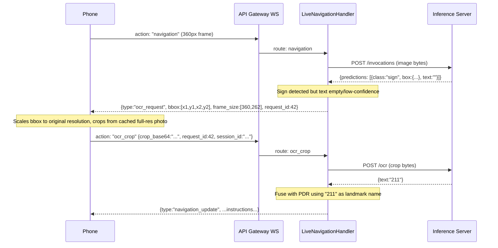

# Detect-then-Zoom OCR Pipeline

## Problem

The frontend downscales frames to 360x262 px to stay under the 32 KB WebSocket limit. Sign bounding boxes end up 6-20 px wide — far too small for OCR. Upscaling a 10 px crop to 400 px cannot recover detail that was never captured.

## Architecture

## Key Design Decisions

- **The phone caches the last captured full-res photo URI** in a ref. When the server responds with `ocr_request`, the phone scales the bbox coordinates back to original resolution, crops the full-res image, and sends just the crop (~5-15 KB, well under 32 KB).
- **New WS route `ocr_crop`** on API Gateway routes to `LiveNavigationHandler`. The handler calls a new `/ocr` endpoint on the inference server (OCR-only, no YOLO).
- **The `navigation` route response changes**: instead of always returning `navigation_update`, if a sign is detected with empty/no text, it first sends an `ocr_request` message and waits for the crop before completing fusion. However, to avoid blocking navigation, **the first `navigation` response is sent immediately with PDR-only position** (no sign fusion), and OCR fusion happens on the follow-up `ocr_crop` message, which sends a corrected `navigation_update`.
- **Graceful fallback**: if the phone doesn't respond with a crop within ~2 seconds, or if OCR still returns empty, navigation continues with PDR-only — no breakage.

## Changes by Layer

### 1. Inference Server — new `/ocr` endpoint

**File:** [inference_server/app/inference_core.py](inference_server/app/inference_core.py)
- Extract `_extract_sign_text` logic into a standalone `ocr_from_image_bytes(image_bytes, content_type)` function that runs the full preprocessing + EasyOCR pipeline on the entire crop image (no YOLO needed).

**New file:** `inference_server/app/routes/ocr.py`
- `POST /ocr` — accepts raw image bytes (the crop), runs `ocr_from_image_bytes`, returns `{"success": true, "text": "211"}`.
- Reuses the same session gate / auth as `/invocations`.

**File:** [inference_server/app/main.py](inference_server/app/main.py)
- Register the new `ocr.router`.

### 2. Backend (Kotlin Lambda) — request crop from phone, handle response

**File:** [aws_resources/backend/src/main/kotlin/com/handlers/LiveNavigationHandler.kt](aws_resources/backend/src/main/kotlin/com/handlers/LiveNavigationHandler.kt)
- After calling `detectObjectsFromImage`, check if any detection is a `sign` with blank `text`.
- If so, **send the normal `navigation_update` immediately** (PDR-only, no sign fusion), **plus** an `ocr_request` message with the sign's bbox and the frame dimensions so the phone can scale coordinates.
- Add a new handler method `handleOcrCrop` for the `ocr_crop` route:
  - Receives `crop_base64`, `session_id`, `request_id`.
  - Calls the inference server's new `/ocr` endpoint with the crop bytes.
  - Uses the returned text for landmark fusion.
  - Sends a corrected `navigation_update` with the fused position.

**File:** [aws_resources/backend/src/main/kotlin/com/services/HttpInferenceClient.kt](aws_resources/backend/src/main/kotlin/com/services/HttpInferenceClient.kt)
- Add `invokeOcrEndpoint(imageBytes: ByteArray): OcrResult` that POSTs to `{base}/ocr`.

### 3. CDK — new WebSocket route

**File:** [aws_resources/cdk/cdk_stack.py](aws_resources/cdk/cdk_stack.py)
- Add route `ocr_crop` mapped to `live_navigation_handler`.

### 4. Frontend — cache full-res photo, handle ocr_request, send crop

**File:** [frontend/app/navigation/navigation.tsx](frontend/app/navigation/navigation.tsx)
- In `captureBase64Frame`: after `takePictureAsync`, **store the full-res `photo.uri` in a ref** (`lastFullResUriRef`) before downscaling. Return both the base64 and the URI (or just stash the URI in the ref).
- In `handleSocketMessage`: add a handler for `type: "ocr_request"`:
  - Read the bbox and `frame_size` from the response.
  - Scale the bbox from the 360px coordinate space back to the full-res image dimensions.
  - Use `manipulateAsync` to crop that region from `lastFullResUriRef.current` (no downscale — full quality, `compress: 0.85`).
  - Send `{ action: "ocr_crop", session_id, crop_base64, request_id }` over the WebSocket.
- Keep the 25 KB size guard; a sign crop from a 1920px image at q=0.85 is typically 5-15 KB.

**File:** [frontend/services/navigationWebSocket.ts](frontend/services/navigationWebSocket.ts)
- Add `OcrCropMessage` interface (action, session_id, crop_base64, request_id).
- Add `sendOcrCrop(message: OcrCropMessage)` method (or reuse `sendFrame` since the payload shape is similar).
- Add `ocr_request` to `NavigationResponse` type (bbox, frame_size fields).

### 5. Min-crop gate (Option D) — still include this

**File:** [inference_server/app/inference_core.py](inference_server/app/inference_core.py)
- In `predict_image_bytes`, if a sign crop is smaller than 30x30 px in the low-res frame, skip OCR entirely and return `text: ""`. This avoids wasting time on hopeless crops in the low-res detection pass. The real OCR will happen on the high-res crop via the two-stage flow.

## What Does NOT Change

- The `action: "frame"` (collision detection) route is untouched — it doesn't need OCR.
- The existing OCR in `predict_image_bytes` for the low-res frame can remain as a fast-path: if OCR succeeds on the low-res crop (sign is close enough), the backend uses it directly without requesting a high-res crop. The two-stage flow only triggers when `text` is empty.
- No changes to DynamoDB, RDS, or the data model (`BoundingBox.text` already exists).
