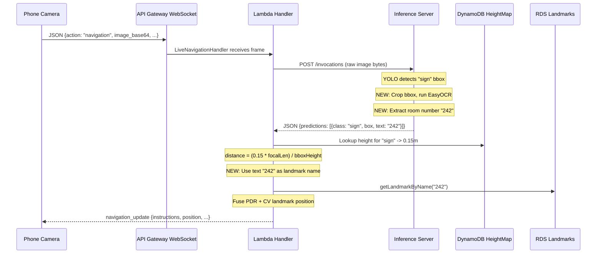

# Sign Detection + OCR Integration Plan

## Full CV Pipeline: Camera to User Response (Step by Step)

Here is exactly what happens today, annotated with what changes for sign detection + OCR.



### Step-by-step trace (current + changes marked)

**1. Phone captures frame** (`navigation.tsx`)
- Camera snapshot -> center crop -> resize to 360px -> JPEG compress 0.4 -> base64
- Sends JSON over WebSocket: `{action: "navigation", session_id, image_base64, focal_length_pixels, heading_degrees, distance_traveled, ...}`
- *No changes needed here*

**2. API Gateway routes by `action` field**
- `"navigation"` -> `LiveNavigationHandler` Lambda (PDR + CV fusion + route instructions)
- `"frame"` -> `ObjectDetectionHandler` Lambda (detection-only, returns distances to app)
- *No changes needed here*

**3. Lambda sends image to inference server**
- `HttpInferenceClient.invokeEndpoint()` does `POST /invocations` with raw image bytes
- *No changes needed here*

**4. Inference server runs YOLO** ([inference_server/app/inference_core.py](inference_server/app/inference_core.py))
- `predict_image_bytes()` loads image with PIL, runs `model(image)`, returns predictions
- Each prediction: `{class: "sign", confidence: 0.92, box: {x1, y1, x2, y2}}`
- **CHANGE**: After YOLO, for any prediction where `class == "sign"`, crop the bbox region from the image, run EasyOCR, and add a `"text"` field to that prediction (e.g. `"text": "242"`)

**5. Lambda parses inference response**
- [UltralyticsInferenceParser.kt](aws_resources/backend/src/main/kotlin/com/services/inference/UltralyticsInferenceParser.kt) maps JSON predictions to `BoundingBox` objects
- **CHANGE**: Parse the new `"text"` field from JSON into `BoundingBox` (add nullable `text` field)

**6. Lambda estimates distance** ([ObjectDetectionHandler.kt](aws_resources/backend/src/main/kotlin/com/handlers/ObjectDetectionHandler.kt))
- Looks up `classHeightMap["sign"]` in DynamoDB -> gets `0.15m`
- Formula: `distance = (avgHeight * focalLength) / bboxHeightPx`
- **CHANGE**: Add `"sign"` to [populate_obj_ddb.py](aws_resources/schema_initializer/populate_obj_ddb.py) with height `0.15m`

**7. LiveNavigationHandler fuses position** ([LiveNavigationHandler.kt](aws_resources/backend/src/main/kotlin/com/handlers/LiveNavigationHandler.kt))
- `fuseLocationWithLandmarks()` picks closest detection
- Currently calls `getLandmarkByName(primaryLandmark.obj.className)` -- which would look up `"sign"` (useless)
- **CHANGE**: If the detected object has OCR text, use that text as the landmark name instead. So it calls `getLandmarkByName("242")` -- matching the actual room number in the RDS Landmarks table
- This requires `DetectedObject` / `BoundingBox` to carry the OCR text through

**8. Lambda responds to phone**
- `navigation_update` with updated instructions, estimated position, etc.
- *No changes to response format needed*

---

## Changes Required

### 1. Inference Server: Add OCR for sign detections

**File:** [inference_server/app/inference_core.py](inference_server/app/inference_core.py)

In `predict_image_bytes()`, after YOLO produces predictions (line ~96-116):
- For each prediction where `class_name == "sign"`, crop the image at `(x1, y1, x2, y2)`
- Run the same preprocessing pipeline we tested (upscale if small + CLAHE + EasyOCR)
- Extract digits with the sanitize regex
- Add `"text": "242"` (or `""` if OCR fails) to that prediction dict

Also add EasyOCR reader initialization at server startup (load once, reuse). Add `easyocr` to [inference_server/requirements.txt](inference_server/requirements.txt).

### 2. Backend: Carry OCR text through the data model

**Files to edit:**

- [BoundingBox.kt](aws_resources/backend/src/main/kotlin/com/models/BoundingBox.kt) -- add `val text: String? = null`
- [UltralyticsInferenceParser.kt](aws_resources/backend/src/main/kotlin/com/services/inference/UltralyticsInferenceParser.kt) -- parse `"text"` field from JSON into `BoundingBox.text`
- [UltralyticsInferenceResponse data classes](aws_resources/backend/src/main/kotlin/com/services/inference/UltralyticsInferenceParser.kt) -- add `val text: String? = null` to `UltralyticsPrediction`

### 3. Backend: Use OCR text for landmark fusion

**File:** [LiveNavigationHandler.kt](aws_resources/backend/src/main/kotlin/com/handlers/LiveNavigationHandler.kt)

In `fuseLocationWithLandmarks()` (line ~125):
- Currently: `getLandmarkByName(primaryLandmark.obj.className)` (looks up `"sign"`)
- Change to: if `primaryLandmark.obj.text` is non-null and non-empty, use that as the landmark name; otherwise fall back to `className`
- This way `getLandmarkByName("242")` matches the room number in the RDS Landmarks table

### 4. DynamoDB: Add sign height

**File:** [populate_obj_ddb.py](aws_resources/schema_initializer/populate_obj_ddb.py)

Add to `COCO_DATA`:
```python
{"id": 80, "name": "sign", "h": 0.15},
```

Re-run the population script (or manually add via AWS console).

### 5. Deploy best.pt

- Copy `model_training/yolo_runs/train2/weights/best.pt` to the inference server machine
- Set `YOLO_MODEL_PATH=/path/to/best.pt` and start the server
- Wire to Lambda via `.env.inference` + `./start_inference_server.sh`

Note: This deploys sign-only detection for now. COCO classes (person, chair, etc.) will return after you retrain with COCO + sign later.

## Files Changed Summary

- **Edit:** `inference_server/app/inference_core.py` -- add OCR after sign detection
- **Edit:** `inference_server/requirements.txt` -- add `easyocr`
- **Edit:** `aws_resources/backend/.../models/BoundingBox.kt` -- add `text` field
- **Edit:** `aws_resources/backend/.../inference/UltralyticsInferenceParser.kt` -- parse `text`
- **Edit:** `aws_resources/backend/.../handlers/LiveNavigationHandler.kt` -- use OCR text for landmark lookup
- **Edit:** `aws_resources/schema_initializer/populate_obj_ddb.py` -- add sign height
- **Deploy:** `best.pt` via `YOLO_MODEL_PATH`
