# Annotated Attack Tree: Stride Physical Harm Vectors

## Attack Tree Diagram

```mermaid
flowchart TB
    ROOT["ROOT: Physical harm or disorientation of Stride user"]
    OR_ROOT["OR"]
    ROOT --> OR_ROOT
    OR_ROOT --> PATH1
    OR_ROOT --> PATH2
    
    %% Path 1: Map data injection (all steps AND)
    PATH1["Path 1: Map data injection leads to wrong navigation"]
    AND_P1["AND"]
    PATH1 --> AND_P1
    AND_P1 --> P1A["Compromise map data at source"]
    AND_P1 --> P1B["Poisoned data reaches user device"]
    AND_P1 --> P1C["User acts on wrong instructions"]
    
    %% P1A: gain access AND modify data
    AND_P1A["AND"]
    P1A --> AND_P1A
    AND_P1A --> P1A1["Gain access to RDS database"]
    AND_P1A --> P1A2["Modify node/edge/landmark data<br/>(distances, bearings critically wrong)"]
    
    %% P1A1: any one avenue (OR)
    OR_ACCESS["OR"]
    P1A1 --> OR_ACCESS
    OR_ACCESS --> P1A1a["Compromise developer account<br/>(keys, env vars, AWS console)"]
    OR_ACCESS --> P1A1b["Compromise CI/CD pipeline<br/>(secrets in GitHub Actions, etc.)"]
    OR_ACCESS --> P1A1c["Credential leak<br/>(.env in repo, logs, build artifacts)"]
    OR_ACCESS --> P1A1d["Phishing or social engineering<br/>(steal session or credentials)"]
    OR_ACCESS --> P1A1e["Insider or stolen device<br/>(legitimate access abused)"]
    
    %% P1B: both conditions AND
    AND_P1B["AND"]
    P1B --> AND_P1B
    AND_P1B --> P1B1["Backend API serves data without integrity check"]
    AND_P1B --> P1B2["App trusts API response (trust boundary crossed)"]
    
    %% P1C: both steps AND
    AND_P1C["AND"]
    P1C --> AND_P1C
    AND_P1C --> P1C1["User follows turn/distance instructions"]
    AND_P1C --> P1C2["Outcome: wrong destination, collision, or fall"]
    
    %% Path 2: MITM on CV (all steps AND)
    PATH2["Path 2: MITM on CV pipeline injects false room/obstacle info"]
    AND_P2["AND"]
    PATH2 --> AND_P2
    AND_P2 --> P2A["Intercept app ↔ SageMaker traffic"]
    AND_P2 --> P2B["Inject or replace CV response"]
    AND_P2 --> P2C["User acts on false CV output"]
    
    %% P2A, P2B, P2C: each has two conditions AND
    AND_P2A["AND"]
    P2A --> AND_P2A
    AND_P2A --> P2A1["Attacker on same network or MITM position"]
    AND_P2A --> P2A2["TLS not enforced or cert validation fails"]
    
    AND_P2B["AND"]
    P2B --> AND_P2B
    AND_P2B --> P2B1["Replace room labels / obstacle warnings in response"]
    AND_P2B --> P2B2["App trusts response as from SageMaker (trust boundary)"]
    
    AND_P2C["AND"]
    P2C --> AND_P2C
    AND_P2C --> P2C1["User cannot verify CV output visually"]
    AND_P2C --> P2C2["Outcome: wrong room, collision, or chaos in hallway"]
    
    style ROOT fill:#8B0000,color:#fff
    style PATH1 fill:#a0522d,color:#fff
    style PATH2 fill:#a0522d,color:#fff
    style OR_ROOT fill:#666,color:#fff
    style AND_P1 fill:#666,color:#fff
    style AND_P1A fill:#666,color:#fff
    style OR_ACCESS fill:#666,color:#fff
    style AND_P1B fill:#666,color:#fff
    style AND_P1C fill:#666,color:#fff
    style AND_P2 fill:#666,color:#fff
    style AND_P2A fill:#666,color:#fff
    style AND_P2B fill:#666,color:#fff
    style AND_P2C fill:#666,color:#fff
```

## Path 1: Map Data Injection → Physical Harm

### How the attack proceeds

1. **Compromise map data at source**
   - Attacker gains access to the RDS instance via one or more of the avenues listed in the diagram above, then modifies node, edge, and/or landmark data. Attackers could create system failures by wiping the data or lure users to compromised positions by injecting new map.
2. **Poisoned data reaches the user device**
   - Backend API reads from data and performs Dijkstra's algorithm to find path passed on map data. There is no database integrity check. Currently poisoned data would be served as-is
   - **Trust boundary:** The mobile app assumes the backend and database are correct. It has no mechanism to verify that distances and bearings are consistent or correct. So the attack “crosses” the trust boundary at **backend API → mobile app**.
3. **User acts on wrong instructions**
   - The app uses the poisoned distances and bearings for both camera and non-camera modes. The user follows turn and distance instructions; with wrong bearings or distances they may walk into a wall, hit a corner, or be sent toward stairs instead of a classroom.
   - Or the system fails entirely and the user is left without service that they rely on.
   - **Outcomes:** Wrong destination, injury, loss of service

### Conditions that must be true for success

All of the following groups must hold (**AND**). Within each group, conditions are **AND** unless marked **OR**.

| Logic | Node / step | Condition |
|-------|-------------|-----------|
| **AND** | **Compromise map data at source** | Both conditions below required. |
| **OR** | **Gain access to RDS database** | Any one of the following avenues: |
| | → Compromise developer account | Attacker gains access to a developer's AWS credentials, API keys, or env vars (e.g. from a compromised machine, keylogger, or reused password). With console/CLI access they can read Secrets Manager (if IAM allows) or use credentials that already have DB access. Developer laptops or shared `.env` files are high-value targets. |
| | → Compromise CI/CD pipeline | Build or deploy pipelines (e.g. GitHub Actions, CodePipeline) often have access to AWS via OIDC or stored secrets. If an attacker can run code in the pipeline (e.g. malicious PR, compromised dependency, or stolen workflow token), they can exfiltrate `DB_SECRET_ARN` or other credentials and connect to RDS from their own environment. |
| | → Credential leak | DB URL, password, or secret ARN ends up in a place an attacker can read: committed in repo (or git history), logged in application or CI logs, exposed in error messages or debug responses, or shipped in build artifacts. Once public or in a breached system, credentials can be used directly against the publicly reachable RDS endpoint. |
| | → Phishing or social engineering | Attacker tricks a developer or ops person into revealing credentials, installing malware that harvests env vars/keys, or logging into a fake AWS/SSO page. One captured session or exported credential set can be enough to read secrets and connect to RDS. |
| | → Insider or stolen device | Someone with legitimate access (developer, contractor, IT) deliberately exfiltrates credentials or modifies map data. Alternatively, a lost or stolen laptop/backup that has `.env`, AWS config, or session tokens gives an attacker the same access. |
| **AND** | Modify node/edge/landmark data | Attacker knows which fields to alter (edges, bearings, distances) and can make changes that are harmful but not obviously inconsistent (e.g., not trivially detectable by sanity checks). |
| **AND** | **Poisoned data reaches user device** | Both conditions below required. |
| **AND** | Backend serves data without integrity check | Backend does not verify integrity of map data before serving, or verification can be bypassed. |
| **AND** | App trusts API response | App does not verify or cross-check map data (e.g., no signing, no consistency checks). |
| **AND** | **User acts on wrong instructions** | Both conditions below required. |
| **AND** | User follows instructions | User relies on the app for navigation (typical for target users). |
| **AND** | Harmful outcome possible | Environment allows the wrong instruction to cause harm (e.g., wall, stairs, obstacle). |

### Where defense might fail

- **Database:** Weak access control, shared or leaked credentials, RDS publicly reachable or reachable from a compromised component such as a user developer AWS account.
- **Backend API:** No integrity checks on data read from DB, no signing of navigation payloads, no alerting on anomalous or bulk updates.
- **Mobile app:** No verification that map data is signed or consistent, full trust in API response. Defense fails at the **trust boundary (API → app)** because the app cannot distinguish legitimate from tampered data.
- **Operational:** Manual measurements are hard to re-verify; no automated or periodic verification of critical edges/bearings against a trusted source.

---

## Path 2: Man-in-the-Middle Attack on CV Pipeline

### How the attack proceeds

1. **Intercept app ↔ SageMaker traffic**
   - Attacker is on the same network as the user (e.g., campus Wi‑Fi, building network) or in a position to MITM. App sends images to the backend which forwards to SageMaker inference endpoint. SageMaker returns room labels and/or obstacle detections.

2. **Inject or replace CV response**
   - Attacker replaces the real response with a forged one, instead of valid instruction set the attacker could inject invalid instructions.
   - **Trust boundary:** The app trusts that the CV response is from the real backend endpoint and unmodified. The user cannot visually verify CV output, so this trust is critical and its violation is the crossing point: **network/SageMaker → app**.
3. **User acts on false CV output**
   - User follows wrong room guidance or fake obstacle warnings (e.g., turning unnecessarily in a busy hallway). Outcomes: wrong room, collision, disorientation, or chaos.

### Conditions that must be true for success

All of the following groups must hold (**AND**). Within each group, both conditions are required (**AND**).

| Logic | Node / step | Condition |
|-------|-------------|-----------|
| **AND** | **Intercept app ↔ SageMaker traffic** | Both conditions below required. |
| **AND** | Attacker on same network or MITM position | Attacker has network position to see or intercept traffic (same LAN, MITM, or compromised network device). |
| **AND** | TLS not enforced or cert validation fails | TLS is absent, or certificate validation is disabled or subvertable (e.g., proxy cert accepted by app). |
| **AND** | **Inject or replace CV response** | Both conditions below required. |
| **AND** | Craft forged response | Attacker can craft a response that matches the app’s expected format (room IDs, obstacle fields). |
| **AND** | App trusts response as from SageMaker | App does not verify response authenticity (e.g., no signing, no integrity check). |
| **AND** | **User acts on false CV output** | Both conditions below required. |
| **AND** | User cannot verify CV output visually | User is blind or has low vision and cannot independently verify CV output. |
| **AND** | Harmful outcome possible | False guidance can cause harm or disruption (wrong room, obstacle, crowded area). |

### Where defense might fail

- **Network:** Campus/building Wi‑Fi is a shared medium; insider or compromised device can perform MITM if TLS is weak.

- **App:** No integrity or authenticity check on CV responses (e.g., no signing by SageMaker or backend); full trust in any response that looks like the expected JSON. Defense fails at the **trust boundary (SageMaker/network → app)** because the app cannot verify that the response is genuine and unmodified.

