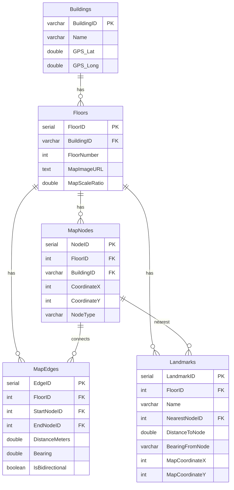
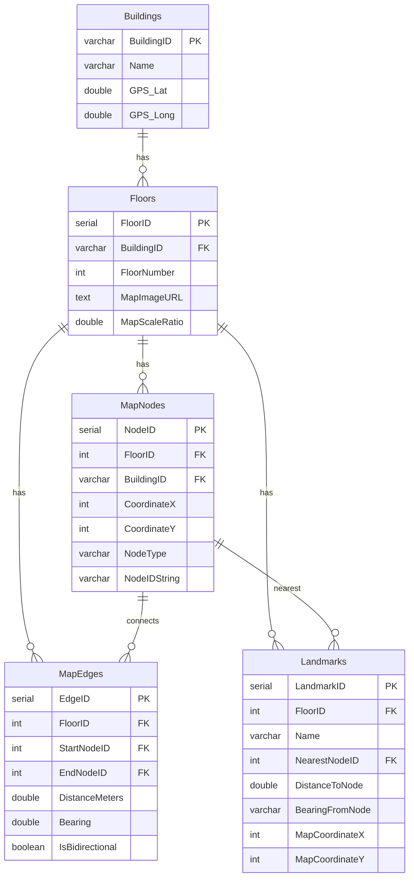

### Database Schema Report: Navigation & Search

This report documents what we found in the original indoor-navigation database schema, the changes we made, and how the new schema aligns with the floor data used for search and navigation.

---

### Summary of the Issue

- **Floor data (`floor2.py`)** defines nodes with **string IDs** (e.g. `r226_door`, `staircase_main_2S01`) and landmarks that reference these via `nearest_node`.
- The **original DB schema** only stored an **integer `NodeID`** in `MapNodes`, and `Landmarks.NearestNodeID` referenced that integer.
- The **search Lambda** returned `NearestNodeID.toString()` as `nearest_node`, so the API responded with `"nearest_node": "29"` instead of `"nearest_node": "r226_door"`.
- The frontend expected the human-friendly node ID (from `floor2.py`) and also needed a stable landmark identifier to pass into `/navigation/start`.

We fixed this by:

- Persisting the string node ID into the database (`MapNodes.NodeIDString`).
- Returning both `landmark_id` and the string `nearest_node` from `/search`.
- Using `landmark_id` (the integer primary key) as the canonical identifier for `/navigation/start`.

---

### Old Schema (Before Changes)

#### Old DBML (core navigation tables)

```dbml
Table Buildings {
  BuildingID varchar(50) [pk]
  Name       varchar(255)
  GPS_Lat    double
  GPS_Long   double
}

Table Floors {
  FloorID      serial [pk]
  BuildingID   varchar(50) [ref: > Buildings.BuildingID]
  FloorNumber  int
  MapImageURL  text
  MapScaleRatio double
}

Table MapNodes {
  NodeID      serial [pk]
  FloorID     int       [ref: > Floors.FloorID]
  BuildingID  varchar(50) [ref: > Buildings.BuildingID]
  CoordinateX int
  CoordinateY int
  NodeType    varchar(20)
}

Table MapEdges {
  EdgeID        serial [pk]
  FloorID       int [ref: > Floors.FloorID]
  StartNodeID   int [ref: > MapNodes.NodeID]
  EndNodeID     int [ref: > MapNodes.NodeID]
  DistanceMeters double
  Bearing       double
  IsBidirectional boolean
}

Table Landmarks {
  LandmarkID    serial [pk]
  FloorID       int [ref: > Floors.FloorID]
  Name          varchar(50)
  NearestNodeID int [ref: > MapNodes.NodeID]
  DistanceToNode double
  BearingFromNode varchar(10)
  MapCoordinateX int
  MapCoordinateY int
}
```

#### Old ER Diagram (Mermaid)



#### Old Search Behavior

- `populate_floor_data.py`:
  - Took each landmark’s `nearest_node` **string** (e.g. `"r226_door"`).
  - Mapped it to a generated `MapNodes.NodeID` (e.g. `29`).
  - Stored only the **integer** `NearestNodeID` on `Landmarks`.
- `StaticNavigationHandler.handleSearch`:
  - Selected `l.Name`, `f.FloorNumber`, `l.NearestNodeID`.
  - Returned `LandmarkResult(nearest_node = NearestNodeID.toString())`.
- Result: API responses like:
  ```json
  {
    "name": "Room 241A",
    "floor_number": 2,
    "nearest_node": "29"
  }
  ```
  instead of the desired `"r241a_door"`.

---

### New Schema (After Changes)

#### New DBML (core changes highlighted)

```dbml
Table Buildings {
  BuildingID varchar(50) [pk]
  Name       varchar(255)
  GPS_Lat    double
  GPS_Long   double
}

Table Floors {
  FloorID      serial [pk]
  BuildingID   varchar(50) [ref: > Buildings.BuildingID]
  FloorNumber  int
  MapImageURL  text
  MapScaleRatio double
}

Table MapNodes {
  NodeID      serial [pk]
  FloorID     int       [ref: > Floors.FloorID]
  BuildingID  varchar(50) [ref: > Buildings.BuildingID]
  CoordinateX int
  CoordinateY int
  NodeType    varchar(20)
  NodeIDString varchar(255)
}

Table MapEdges {
  EdgeID        serial [pk]
  FloorID       int [ref: > Floors.FloorID]
  StartNodeID   int [ref: > MapNodes.NodeID]
  EndNodeID     int [ref: > MapNodes.NodeID]
  DistanceMeters double
  Bearing       double
  IsBidirectional boolean
}

Table Landmarks {
  LandmarkID    serial [pk]
  FloorID       int [ref: > Floors.FloorID]
  Name          varchar(50)
  NearestNodeID int [ref: > MapNodes.NodeID]
  DistanceToNode double
  BearingFromNode varchar(10)
  MapCoordinateX int
  MapCoordinateY int
}
```

#### New ER Diagram (Mermaid)



#### New Population Behavior

- `MapNodes` insertion now also writes the string ID:

```python
INSERT INTO MapNodes (FloorID, BuildingID, CoordinateX, CoordinateY, NodeType, NodeIDString)
VALUES (..., node['type'], node.get('id'))
```

So for a node like:

```python
{ "id": "r226_door", "x_feet": -28, "y_feet": 0, "type": "Door" }
```

the DB stores:

- `NodeID = 29` (for example)
- `NodeIDString = "r226_door"`

`Landmarks.NearestNodeID` still points to the integer `NodeID`, but we can now recover the string ID via a join.

#### New Search Response Behavior

Backend (`StaticNavigationHandler.handleSearch`):

- Now selects:

```sql
SELECT
  l.LandmarkID,
  l.Name,
  f.FloorNumber,
  COALESCE(n.NodeIDString, CAST(l.NearestNodeID AS VARCHAR)) AS NearestNodeDisplay
FROM Landmarks l
JOIN Floors f ON l.FloorID = f.FloorID
LEFT JOIN MapNodes n ON l.NearestNodeID = n.NodeID
WHERE l.Name ILIKE ?
LIMIT ?
```

- Returns:

```kotlin
LandmarkResult(
  landmark_id = rs.getInt("LandmarkID"),
  name = rs.getString("Name"),
  floor_number = rs.getInt("FloorNumber"),
  nearest_node = rs.getString("NearestNodeDisplay")
)
```

OpenAPI (`docs/openapi.yaml`) now defines:

```yaml
LandmarkResult:
  type: object
  required:
    - landmark_id
    - name
    - floor_number
    - nearest_node
  properties:
    landmark_id:
      type: integer
    name:
      type: string
    floor_number:
      type: integer
    nearest_node:
      type: string
      description: String ID of the nearest navigation node (e.g. "r226_door").
```

Frontend (`frontend/services/api.ts`):

```ts
export interface LandmarkResult {
  landmark_id: number;
  name: string;
  floor_number: number;
  nearest_node: string;
}
```

Example new response:

```json
{
  "results": [
    {
      "landmark_id": 1,
      "name": "Room 241A",
      "floor_number": 2,
      "nearest_node": "r241a_door"
    }
  ]
}
```

The frontend uses:

- `landmark_id` for `destination.landmark_id` when calling `/navigation/start`.
- `nearest_node` for display and potentially future UI hints.

---

### Root Cause vs. Fix (One-Liner)

- **Root cause:** The database schema did not persist the string node IDs from the floor data, so the search endpoint could only return the integer `NodeID` as a string (`"29"`), not the human-readable `nearest_node` (`"r226_door"`).
- **Fix:** Store the string node ID in `MapNodes.NodeIDString`, join it in the search query, and return it as `nearest_node` (while also exposing `landmark_id` for navigation). 

