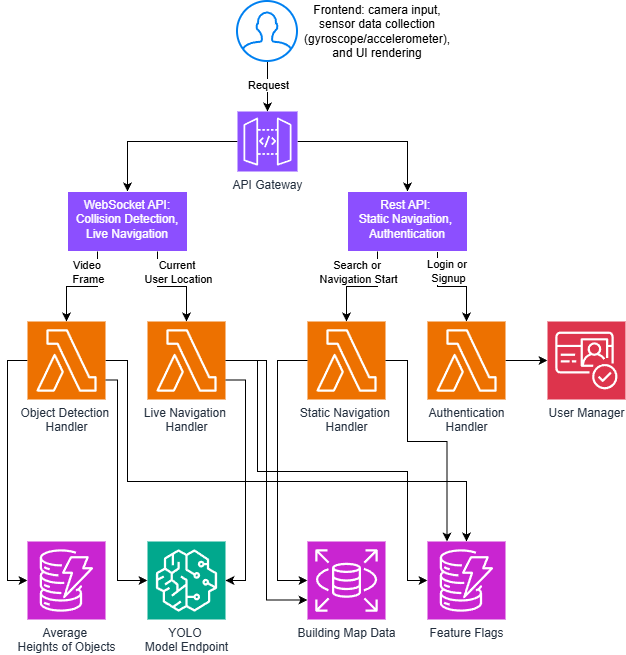

# Stride Documentation: Explanation

## System Overview
Stride is an accessibility application designed to assis visually impaired users with indoor navigation and obstacle detection. The system follows a serverless, event-drive architecture that uses a mobile frontend machine learning and navigation logic hosted on AWS. To provide low-latency feedback, Stride utilizes real-time video streaming via WebSockets and asynchronous processing while avoiding heacy local computation on the user's device.

## Architecture Diagram
The following diagram illustrates the high-level workflow of the Stride.

## Key Components
* Mobile Client: Built using React Native and Expo; the frontend handles the camera input, data collection from the device sensors (gyroscope/accelerometer/gps), and UI rendering of results from the backend.
* API Layer: This is a Kotlin-based backend that is deployed as AWS Lambda Functions integrated with Amazon API Gateway. This includes the AuthHandler for identity, ObjectDetectionHandler for frame processing and collision detection, and the [Static/Live]NavigationHandler for path calculations.
* Inference Layer: This is a dedicated SageMaker endpoint running a YOLOv11 nano model inside a CUDA-enabled Docker container for fast object detection.

## Design Decisions
* Kotlin for Lambda Functions: Kotlin was chosen for its strong typing, null safety, and faster runtime than Python. We are utilizing SnapStart feature of AWS Lambda to mitigate the tradeoffs that come with using Lambda and the associated "cold start" latencies.

* WebSocket API: We deemed the standard REST API to be insufficient for the live streaming of data from client to backend, this data includes video frames and sensor data. With the use of WebSockets we can create a persistent bi-directional connection and mitigate the increased latency of creating a connection for reach request.

* Independent CI/CD workflows: Our repository uses separate GitHub actions for CI and CD to ensure that frontend changes do not trigger a 15-minute deployment of the backend unless the backend code itself is modified.

* Separation of Navigation workflows: We separated the navigation workflows into two categories: live and static. The static navigation creates navigation sessions and provides an initial list of instructions, while the live navigation receives continuous sensor updates and video frames to re-localize the user and perform path recalculation if required. This was done due to the separation of APIs into a REST API and WebSocket API as depcited in the diagram above.

## Tradeoffs and Limitations
* Heuristic Distance Estimation vs. Hardware Depth Sensors: To estimate the distance of detected obstacles, the system relies on a DynamoDB table that maps recongnized YOLOv11 classes to average real-world heights. This is less accurate than utilizing hardware depth sensors (such as LiDAR found on newer mobile devices). However, it ensures the application is hardware-agnostic and accessible to a wider range of users. This also helps improve application performance on the client side.

* Compute Over-Provisioning for Latency: The heavy lifting Lambdas (object detection and navigation) are provisioned with 3008 MB of memory. This tradeoff maximizes CPU allocation for faster video frame processing, at the cost of higher execution fees.

* Network Isolation vs Development Velocity: The current RDS database is deployed with ``publicly_accessible=true`` to allow Lambdas to connect via the standard internet without needing to be placed inside a private VPC. This method allows us to bypass significant cold-start penalities and makes development simpler. However, this is a security tradeoff because we are relying entirely on secure credential injection through AWS Secrets Manager, rather than strict network isolation with VPC.